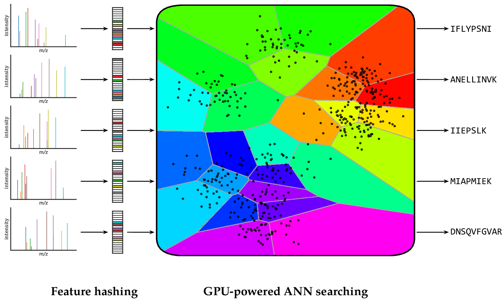

ANN-SoLo
========

For more information:

* [Official code website](https://github.com/bittremieux/ANN-SoLo)

**ANN-SoLo** (**A**pproximate **N**earest **N**eighbor **S**pectral **L**ibrary) is a spectral library search engine for fast and accurate open modification searching. ANN-SoLo uses approximate nearest neighbor indexing to speed up open modification searching by selecting only a limited number of the most relevant library spectra to compare to an unknown query spectrum. This is combined with a cascade search strategy to maximize the number of identified unmodified and modified spectra while strictly controlling the false discovery rate and the shifted dot product score to sensitively match modified spectra to their unmodified counterpart.

The software is available as open-source under the Apache 2.0 license.

If you use ANN-SoLo in your work, please cite the following publication:

- Wout Bittremieux, Pieter Meysman, William Stafford Noble, Kris Laukens. **Fast Open Modification Spectral Library Searching through Approximate Nearest Neighbor Indexing.** _Journal of Proteome Research_ (2018). [doi:10.1021/acs.jproteome.8b00359](https://doi.org/10.1021/acs.jproteome.8b00359)

Running ANN-SoLo
----------------

ANN-SoLo requires Python 3.5 or higher.

The ANN-SoLo installation depends on NumPy. When NumPy is available ANN-SoLo can easily be installed using pip (pip3):

    pip install ann_solo

For detailed instructions on how to run ANN-SoLo see the `src` folder or run `ann_solo -h` to pull up instructions on the ANN-SoLo command-line interface.

Contact
-------

For more information you can visit the [official code website](https://github.com/bittremieux/ANN-SoLo) or send a mail to <wout.bittremieux@uantwerpen.be>.
